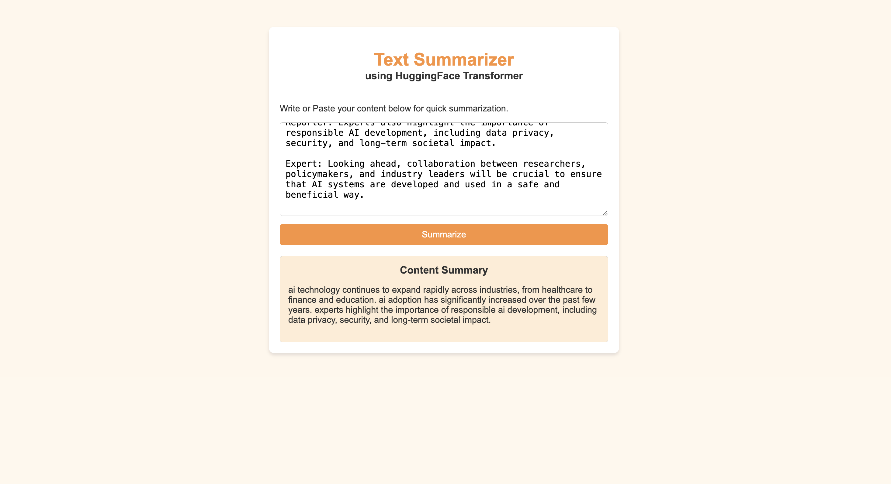

# Text Summarizer

A local text summarization web application built with **FastAPI**, **PyTorch**, and a fine-tuned **T5** model from Hugging Face. Paste a dialogue, article, or other text into the browser and receive a concise generated summary without sending the text to an external API.



## Features

- Simple browser interface for entering text and viewing the generated summary.
- Fine-tuned T5 model loaded from the local `saved_summary_model/` directory.
- Text preprocessing that removes HTML tags, normalizes whitespace, and lowercases input.
- JSON API endpoint for integrating summarization into another client.
- Automatic device selection for Apple Silicon MPS, CUDA, or CPU.
- Local inference after the model has been downloaded or copied into the project.

## How It Works

1. The browser sends the entered text to `POST /summarize/`.
2. FastAPI validates the request using the `DialogueInput` Pydantic model.
3. The text is cleaned and tokenized with the saved T5 tokenizer.
4. The T5 model generates a summary using beam search.
5. The API returns the generated text as JSON, and the page displays it.

The model accepts up to 512 input tokens. Longer content is truncated before generation, and summaries are generated with a maximum length of 150 tokens.

## Requirements

- macOS, Linux, or Windows
- Python 3.10 or newer
- A Python environment containing the packages below
- The files in `saved_summary_model/`

Recommended packages:

```bash
pip install fastapi uvicorn jinja2 python-multipart torch transformers sentencepiece
```

`sentencepiece` is required by the T5 tokenizer. PyTorch can be installed separately when a platform-specific build is needed; use the official PyTorch installation selector for the appropriate command for your machine.

## Run Locally

Open a terminal in the project directory:

```bash
cd "31_DeepLearning(TextSummarizer)"
```

Start the development server:

```bash
uvicorn app:app --reload
```

Open [http://127.0.0.1:8000](http://127.0.0.1:8000) in a browser. Stop the server with `Ctrl+C`.

The `--reload` option automatically restarts the server when Python files change. The model is loaded when the application starts, so startup may take a little longer than a typical small FastAPI service.

## API Usage

### `GET /`

Returns the HTML user interface.

### `POST /summarize/`

Request body:

```json
{
	"dialogue": "Alex: Are we still meeting at three? Sam: Yes, I will bring the notes."
}
```

Example with `curl`:

```bash
curl -X POST "http://127.0.0.1:8000/summarize/" \
	-H "Content-Type: application/json" \
	-d '{"dialogue":"Alex: Are we still meeting at three? Sam: Yes, I will bring the notes."}'
```

Example response:

```json
{
	"summary": "Alex and Sam confirm their meeting at three, and Sam will bring the notes."
}
```

FastAPI also provides interactive API documentation at [http://127.0.0.1:8000/docs](http://127.0.0.1:8000/docs).

## Model and Datasets

The application uses the locally saved model and tokenizer in `saved_summary_model/`. These files must remain in that directory because `app.py` loads them with:

```python
T5ForConditionalGeneration.from_pretrained("./saved_summary_model")
T5Tokenizer.from_pretrained("./saved_summary_model")
```

The repository includes the SAMSum dialogue summarization dataset split into:

- `samsum-train.csv` for training
- `samsum-validation.csv` for validation
- `samsum-test.csv` for testing

The notebook `F1_TextSummarizer (1).ipynb` contains the exploratory work, preprocessing, tokenization, training, saving, and manual testing workflow used to create the local model.

## Project Structure

```text
.
├── app.py                         # FastAPI application and inference logic
├── index.html                     # Browser interface and JavaScript client
├── image.png                      # README application screenshot
├── saved_summary_model/           # Fine-tuned T5 model and tokenizer
├── F1_TextSummarizer (1).ipynb    # Training and experimentation notebook
├── samsum-train.csv               # Training data
├── samsum-validation.csv         # Validation data
├── samsum-test.csv                # Test data
└── README.md                      # Project documentation
```

## Device Selection

At startup, the application tries to use hardware acceleration in this order:

1. Apple Silicon MPS
2. NVIDIA CUDA
3. CPU fallback

CPU inference works on machines without a supported accelerator, but generating a summary may take longer.

## Troubleshooting

### `500 Internal Server Error` on `/`

Make sure the server is started from the project directory so `index.html` and `saved_summary_model/` can be found. The template route uses the current Starlette `TemplateResponse` argument format.

### `404 Not Found` for `/favicon.ico`

This is only the browser looking for an optional favicon. It does not affect the summarizer. Add a favicon file and route later if a custom browser tab icon is required.

### `ModuleNotFoundError`

Install the dependencies in the same Python environment used to run Uvicorn:

```bash
python -m pip install fastapi uvicorn jinja2 python-multipart torch transformers sentencepiece
```

Verify the environment with:

```bash
python -c "import fastapi, torch, transformers; print('Dependencies are available')"
```

### Model loading errors

Confirm that `saved_summary_model/` contains `config.json`, `model.safetensors`, tokenizer files, and generation configuration. Run Uvicorn from the directory containing that folder.

## Notes

- This project is intended for local experimentation and demonstration.
- The model output depends on the quality and length of the supplied text.
- Input longer than the tokenizer limit is truncated, so important details near the end may be omitted.
- Do not commit private or sensitive conversations when sharing this project publicly.